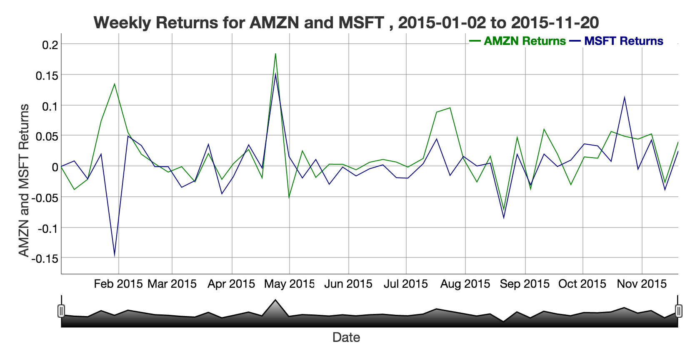
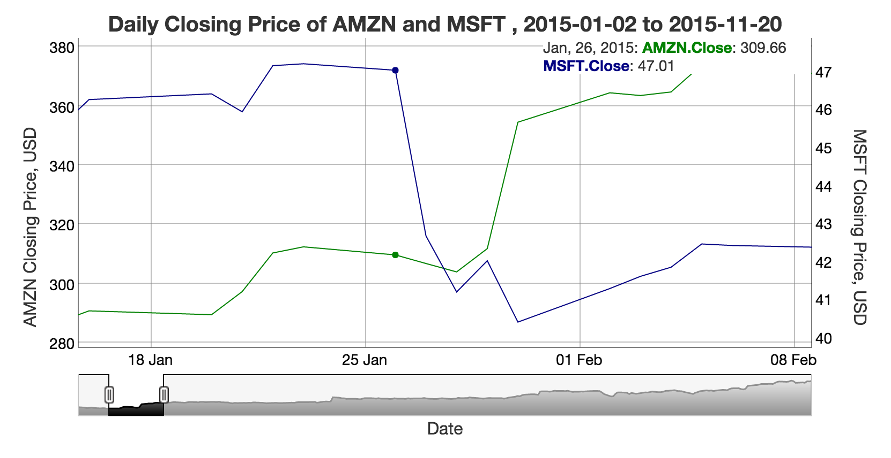

## Project Overview

### Purpose:
Interactively explore the historical prices and returns of two user defined stocks

### Steps:
1. Pull stocks from Yahoo finance
2. Use dygraphs to visualize output
3. Explore / analyze charts in an interactive fashion

### Product:
This product is live at https://bolseando.shinyapps.io/stocksview/

---
## Step 1: Pulling stock data from Yahoo! Finance

The library <code> quantmod </code> is used to pull stock data from Yahoo! Finance. A basic pull is as follows:


```
library(quantmod)
```

```
## Loading required package: xts
```

```
## Loading required package: zoo
```

```
## Warning: package 'zoo' was built under R version 3.2.5
```

```
## 
## Attaching package: 'zoo'
```

```
## The following objects are masked from 'package:base':
## 
##     as.Date, as.Date.numeric
```

```
## Loading required package: TTR
```

```
## Warning: package 'TTR' was built under R version 3.2.4
```

```
## Version 0.4-0 included new data defaults. See ?getSymbols.
```

```r
getSymbols(c('MSFT'),src='yahoo')
```

```
##     As of 0.4-0, 'getSymbols' uses env=parent.frame() and
##  auto.assign=TRUE by default.
## 
##  This  behavior  will be  phased out in 0.5-0  when the call  will
##  default to use auto.assign=FALSE. getOption("getSymbols.env") and 
##  getOptions("getSymbols.auto.assign") are now checked for alternate defaults
## 
##  This message is shown once per session and may be disabled by setting 
##  options("getSymbols.warning4.0"=FALSE). See ?getSymbols for more details.
```

</br>
The above pull returns the following time series (xts) object (the below data is pulled when this document is slidified):


```
##            MSFT.Open MSFT.High MSFT.Low MSFT.Close
## 2007-01-03     29.91     30.25    29.40      29.86
## 2007-01-04     29.70     29.97    29.44      29.81
## 2007-01-05     29.63     29.75    29.45      29.64
## 2007-01-08     29.65     30.10    29.53      29.93
## 2007-01-09     30.00     30.18    29.73      29.96
```

---
## Step 2: Powerful graphing of time series objects

##### The time series object returned by <code>quantmod</code> :

1. It's indexed by date, so jumping to a date range is fast. Dygraphs takes advantge of this indexing for fast interactive charting.
2. There are powerful time-related functions. For example, the <code>weeklyReturn</code> executes the following 2 steps:
    + 1-line aggregation by time period (i.e., week, month, year)
    + Calculate rate of return for that time period

##### The <code>weeklyReturn</code> commmand drives this graph of rates of return:
    
<div style='text-align: center;'>
    
</div>

---
## Step 3: An example analysis of two stocks

1. View the shinyapps.io site with default values: tickers "AMZN" and "MSFT", dates "2015-01-02" to "2015-11-20."
2. Note large swings in the price of each stock at the end of January 2015.
3. Zoom in on this time period, using the slider at the bottom of either chart.
4. Hovering over the chart, we see exact prices and dates. We can discern that MSFT dropped from 47.01 to 40.4 in the same 4-day span that AMZN rose from 309.56 to 354.53. Some googling reveals root causes - that week, AMZN jumped on strong earnings, while MSFT fell on declining Windows revenues, and despite strong earnings.
5. Explore more stock price data on your own!

<div style='text-align: center;'>
    
</div>
</br>

